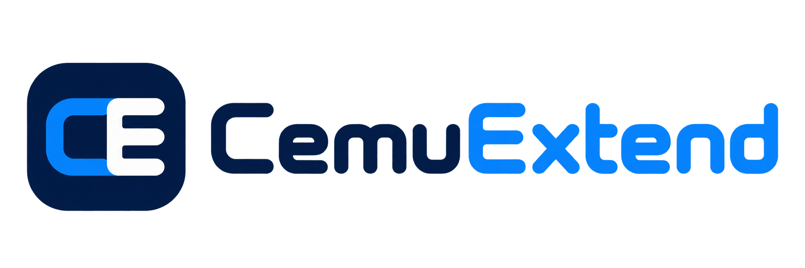

# CemuExtend

[English](README.md) | **日本語**

  

**Wii Uゲームを、もっと自由にModと創作と実験の場へ。**

CemuExtendは、オープンソースのWii Uエミュレーター[Cemu](https://github.com/cemu-project/Cemu)をベースにしたコミュニティフォークです。使い慣れたCemuの体験を保ちながら、プレイヤーやMod制作者、ゲームコミュニティのためのModプラットフォームと追加ツールを備えています。

Wii UゲームやHomebrewを遊ぶだけなら、CemuExtendはCemuとほぼ同じように使えます。大きな違いは、導入しやすいMod、権限の管理、幅広いプラグインへの対応、そしてModとPCをつなぐ便利な機能が追加されていることです。

## Cemuとの違い

CemuExtendはCemuを置き換えるものではなく、その上に新しい機能を加えたプロジェクトです。Cemuのゲーム互換性、コントローラー対応、Graphic Pack、セーブ管理など、使い慣れた機能を引き続き利用できます。

さらに、CemuExtendには次の機能があります。

- **`.cemod`パッケージ** — Wii U向けModを導入・共有するための専用形式です。
- **内蔵Modマネージャー** — CemuExtendの画面からModの確認、有効化、無効化、管理ができます。
- **権限確認** — ゲームを起動する前にModが何へアクセスするかを確認し、許可する項目を選べます。
- **複数種類のModに対応** — CemuExtend向けModに加え、`.cemod`として配布される互換WUPSプラグインも利用できます。
- **ModとPCの連携** — 許可したModから、キーボードやマウス、文字入力、ファイル、設定、クリップボード、ウィンドウ、スクリーンショットなどを活用できます。
- **TCPGecko互換機能を内蔵** — Wii U側で別のHomebrewを起動せずに、対応TCPGeckoクライアントを接続できます。

これらの追加機能により、高度なModを導入しやすくしながら、重要な選択はプレイヤー自身が確認できるようになっています。

## 機能

### 使い慣れたCemuの体験

Cemuと同じように、Wii Uゲーム、Homebrew、ASM Graphic Packを実行できます。Cemuを利用したことがあれば、自然に使い始められます。

### パッケージでModを導入

Modは1つの`.cemod`ファイルとして配布できます。CemuExtendが各パッケージの対応ゲームを認識するため、タイトルIDを手作業で入力せずに管理できます。

### Modのアクセスを自分で管理

Modが保護された機能を使う前に、CemuExtendが権限確認画面を表示します。Modの内容が変わった場合や、より多くの権限を求めるようになった場合は、再度承認が必要になることがあります。

ゲームに対する強い権限を必要とするModもあります。信頼できる制作者から入手したパッケージだけを承認してください。

### 入力とデスクトップ機能を活用

対応Modでは、キーボード、マウス、文字入力、コントローラーマッピング、設定、ファイル保存、クリップボード、ウィンドウ操作、スクリーンショット、診断情報などを利用できます。実際に使える機能はModの内容と許可した権限によって異なります。

### TCPGeckoツールを接続

CemuExtendには、対応クライアント向けのTCPGecko互換サーバーが内蔵されています。この機能は初期状態では無効で、自分のPCからの接続だけに制限することもできます。

## 周辺プロジェクト

CemuExtendのエコシステムは、役割ごとに次のプロジェクトへ分かれています。

- **[cemod-sdk](https://github.com/CemuExtend/cemod-sdk)** — `.cemod`ファイルの作成、確認、パッケージ化、署名に使うツールです。
- **[libcemuextend](https://github.com/CemuExtend/libcemuextend)** — ModからCemuExtendの機能を利用するためのライブラリです。
- **[cemod-example](https://github.com/CemuExtend/cemod-example)** — 完成したサンプルModで、新しいプロジェクトを始める際の参考として利用できます。

## プロジェクトの状況

CemuExtendは独立したコミュニティプロジェクトであり、Cemuの公式リリースではありません。Modやプラグインの互換性はそれぞれ異なり、一部の機能は現在も開発が続いています。通常のCemuに関する質問や本家エミュレーターの開発については、[Cemu公式リポジトリ](https://github.com/cemu-project/Cemu)をご覧ください。

## ライセンス

CemuExtendは、本家Cemuと同じ[Mozilla Public License 2.0](LICENSE.txt)でライセンスされています。同梱されている一部のコンポーネントには、それぞれ個別のライセンスが適用されます。詳しくは各ファイルに付属する表記をご確認ください。

Rust rewrite の preview/release artifact を配布する場合は、Docker build が出力する `Cemu` 実行ファイルだけでなく、同じ `result/rust/` に生成される `LICENSE.txt` と `THIRD_PARTY_LICENSES.txt` も必ず同梱してください。`rust-headless` image では同じファイルを `/usr/share/licenses/cemuextend/` に配置します。

CemuExtendは、[Cemuプロジェクト](https://github.com/cemu-project/Cemu)とコントリビューターの成果をもとにしています。
